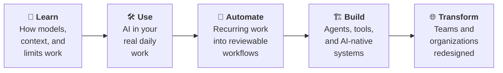

<div align="center">

# Practice

### The open community for AI practitioners.

**Learn it. Build it. Use it. Share it.**

*Making practical AI capability open and accessible to everyone.*

[What this is](#what-this-is) · [Start here](#start-here) · [The ladder](#the-capability-ladder) · [What we publish](#what-we-publish) · [Contribute](#how-to-contribute) · [Project status](#where-this-project-is-right-now)

</div>

---

## What this is

Most AI advice is either a demo or a hot take. Practice is neither.

It is an open community and a public library of **methods that people actually
ran, wrote down honestly, and made reusable** — including the parts that did
not work. Everything here is plain text in an open Git repository, so anyone
who can reach it can read it, copy it, correct it, or fork it. Nothing is
behind a signup.

You do not need to be an engineer. If your job now involves getting useful work
out of AI tools, this is for you.

**Practice is not** a course, a certification, a consultancy, a newsletter, or
a place to collect prompts and argue about model releases. What else is out of
scope is written down in [NON_GOALS.md](NON_GOALS.md).

## Who it's for

| If you are… | You are here to… |
|---|---|
| 🌱 **New to this** | Get past demos to something that reliably helps your real work |
| 🔧 **An engineer or builder** | Design agents, tools, and AI-native systems that hold up |
| ⚙️ **An operator or analyst** | Turn recurring work into workflows you can review and trust |
| 🏢 **A leader or founder** | Redesign how a team works, without betting on hype |
| 🤝 **A consultant or internal champion** | Bring evidence, not slideware, to the people you advise |

## Start here

| I want to… | Go to |
|---|---|
| Understand what Practice believes | [The manifesto](docs/founding/MANIFESTO.md) |
| Find my starting point | [Capability self-assessment](community/CAPABILITY_SELF_ASSESSMENT.md) |
| Learn the whole path, in order | [The AI-Native Practitioner guide](guides/ai-native-practitioner/README.md) |
| Try a concrete method today | [Method candidates](practices/README.md) |
| See what an experiment looks like | [Labs](labs/README.md) |
| Join the community | [Onboarding](community/ONBOARDING.md) |
| Give something back | [Contributor quickstart](community/CONTRIBUTOR_QUICKSTART.md) |

## The capability ladder

Practice organizes everything around five steps. You do not have to climb them
all — most people want to get solidly good at one or two.



The full definitions live in [the capability ladder](docs/framework/CAPABILITY_LADDER.md).

## What we publish

Six kinds of artifact, each with a schema so a reader always knows how much
evidence stands behind what they are reading.

| | Artifact | What it is |
|---|---|---|
| 🧪 | **Practice** | A reusable method — inputs, steps, outputs, how to evaluate it, how it fails |
| 📘 | **Guide** | An opinionated path that strings several Practices into a journey |
| 🔬 | **Lab** | A reproducible experiment or evaluation, with its limits stated |
| 📖 | **Story** | A real implementation: before, intervention, result, lessons |
| 📝 | **Note** | A smaller observation that may one day grow into a Practice |
| 🧰 | **Project** | Open-source software or infrastructure built by the community |

A method only becomes a **tested Practice** after someone runs it, records the
trial, and a human maintainer reviews the evidence. Until then it says
`proposed` on its face. That rule is the whole point of the project.

See [the taxonomy](docs/framework/TAXONOMY.md) for how the pieces fit together.

## Where this project is right now

**Practice is pre-launch and built in the open.** Being honest about that is
part of the standard we are trying to set, so here is the real state:

- ✅ The library, guide, schemas, governance, and tooling are written and validated.
- 🟡 All six methods are **proposed candidates**. Three have recorded trials in
  [labs/002–004](labs/README.md); a recorded trial is not a promotion, and none
  has a human promotion decision yet.
- 🔴 The community hub is not open. There is no public invitation route yet.

Nothing in this repository claims a result it cannot show you the evidence for.
Open decisions are tracked in [OWNER_GATES.md](OWNER_GATES.md), and the
launch criteria are in [the launch checklist](release/LAUNCH_CHECKLIST.md).

## How to contribute

The highest-status action here is simple:

> **I learned something useful and made it easier for the next person.**

You can start with a typo fix. Corrections, questions, and honest "this did not
work for me" reports are real contributions — and the fastest of them takes a
few minutes.

1. Read the [contributor quickstart](community/CONTRIBUTOR_QUICKSTART.md).
2. Open an issue with the form that matches what you have:
   [correction](.github/ISSUE_TEMPLATE/correction.yml) ·
   [note](.github/ISSUE_TEMPLATE/note.yml) ·
   [practice](.github/ISSUE_TEMPLATE/practice.yml) ·
   [lab](.github/ISSUE_TEMPLATE/lab.yml) ·
   [story](.github/ISSUE_TEMPLATE/story.yml) ·
   [project](.github/ISSUE_TEMPLATE/project.yml).
3. Follow [CONTRIBUTING.md](CONTRIBUTING.md) for the full flow and the evidence
   each kind of claim needs.

Every issue is categorized, verified, and routed under a published
[triage policy](.github/TRIAGE_POLICY.md). Humans make the acceptance
decisions; agents may label and recommend only.

## Community, governance, and licensing

| | |
|---|---|
| [Code of Conduct](CODE_OF_CONDUCT.md) | What is expected, and how to report a concern privately |
| [Governance](community/GOVERNANCE.md) | Who decides what, and how decisions change |
| [Moderation model](community/MODERATION.md) | How concerns are assessed, by humans |
| [Security policy](SECURITY.md) | What to report, and how — never in a public issue |
| [Attribution](community/ATTRIBUTION.md) | How contributors are credited |
| [Licenses](LICENSES.md) | Apache-2.0 for code · CC BY 4.0 for content |

## Working on the repository itself

Practice is assembled by a coordinated set of AI agents working in isolated
worktrees, each producing a committed handoff that a human reviews. If you want
to run or extend that build:

- [NEW_TERMINAL.md](NEW_TERMINAL.md) — get a working copy and run the checks
- [SWARM_PLAN.md](SWARM_PLAN.md) — topology, waves, and the merge protocol
- [AGENTS.md](AGENTS.md) — the rules every agent must follow
- [ARCHITECTURE.md](ARCHITECTURE.md) — how the repository is laid out

```bash
./scripts/init.sh
make doctor          # check the environment
make validate        # repository structure, manifest, and schemas
make status          # where the build stands
make ready           # tasks whose dependencies are met
```

Run the full check the way CI does:

```bash
python3 -m unittest discover -s tests
python3 scripts/validate.py --release
python3 scripts/validate_artifacts.py
python3 scripts/check_links.py
```

<details>
<summary><b>Build-kit reference — release criteria and key files</b></summary>

<br/>

The first release is complete when Practice has:

1. A seeded Buzz community with clear onboarding and no empty public channels.
2. A public repository with the manifesto, governance, contribution system, licenses, and code of conduct.
3. The AI-Native Practitioner guide map plus substantive initial modules.
4. Three tested Open Practices — see the honest count in
   [project status](#where-this-project-is-right-now); no candidate has a
   recorded promotion decision, so this criterion is unmet.
5. Five scoped community-agent profiles, with human-reviewed permissions.
6. A launch narrative, first ten content briefs, invite funnel, and first Practice Session runbook.
7. Independent fact, editorial, onboarding, and repository-integrity reviews.

Release validation derives completion from the committed manifest-owned outputs
and `COMPLETE` handoffs. Construction status in `.swarm/state.json` is local,
ignored operational state: useful to the task controller, but not release
evidence and not reproducible from a checkout.

Key files beyond the four documents above:

| File | What it holds |
|---|---|
| `tasks/manifest.json` | The machine-readable task and dependency graph |
| `tasks/specs/` | One spec per task: objective, owned outputs, acceptance |
| `prompts/ORCHESTRATOR.md` | The master prompt for the coordinating model |
| `buzz/community.json` | The idempotent Buzz community specification |
| `scripts/buzz_bootstrap.py` | The dry-run-first Buzz seeder |
| `buzz/PROJECT_AND_WORKFLOW_RUNBOOK.md` | Owner-run Buzz Project setup and a disabled workflow pilot |
| `research/BUZZ_PLATFORM_SNAPSHOT.md` | Verified Buzz platform constraints, as of 2026-09-01 |
| `NON_GOALS.md` | What deliberately does not belong in this build |

Every ordinary task owns a non-overlapping file set, has explicit dependencies,
and must produce a committed handoff. The task controller rejects branches that
change paths outside that ownership; integration and revision tasks carry a
narrow, declared exception so they can apply reviewed corrections.

</details>

<div align="center">

---

**Practice** · Build the open standard for becoming AI-native.

</div>
