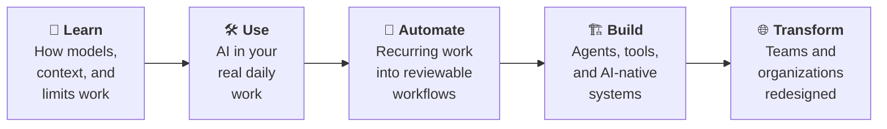

<div align="center">

# Practice

### The open community for AI practitioners.

**Learn it. Build it. Use it. Share it.**

*Making practical AI capability open and accessible to everyone.*

[What this is](#what-this-is) · [Start here](#start-here) · [The ladder](#the-capability-ladder) · [What we publish](#what-we-publish) · [Contribute](#how-to-contribute) · [Project status](#where-this-project-is-right-now) · [Repository map](#repository-map)

</div>

---

## What this is

Most AI advice is either a demo or a hot take. Practice is neither.

It is an open community and a public library whose standard is **methods that
someone actually ran, wrote down honestly, and made reusable** — including the
parts that did not work. Everything here is plain text in an open Git repository, so anyone
who can reach it can read it, copy it, correct it, or fork it. Nothing is
behind a signup.

You do not need to be an engineer. If your job now involves getting useful work
out of AI tools, this is for you.

**Practice is not** a course, a certification, a consultancy, a newsletter, or
a place to collect prompts and argue about model releases. What else is out of
scope is written down in [docs/NON_GOALS.md](docs/NON_GOALS.md).

## Who it's for

| If you are… | You are here to… |
|---|---|
| 🌱 **New to this** | Get past demos to something that reliably helps your real work |
| 🔧 **An engineer or builder** | Design agents, tools, and AI-native systems that hold up |
| ⚙️ **An operator or analyst** | Turn recurring work into workflows you can review and trust |
| 🏢 **A leader or founder** | Redesign how a team works, without betting on hype |
| 🤝 **A consultant or internal champion** | Bring evidence, not slideware, to the people you advise |

## Start here

| I want to… | Go to |
|---|---|
| Understand what Practice believes | [The manifesto](docs/founding/MANIFESTO.md) |
| Find my starting point | [Capability self-assessment](community/CAPABILITY_SELF_ASSESSMENT.md) |
| Learn the whole path, in order | [The AI-Native Practitioner guide](guides/ai-native-practitioner/README.md) |
| Try a concrete method today | [Proposed method candidates](practices/README.md) |
| See what an experiment looks like | [Labs](labs/README.md) |
| Join the community | [Onboarding](community/ONBOARDING.md) |
| Give something back | [Contributor quickstart](community/CONTRIBUTOR_QUICKSTART.md) |

## The capability ladder

Practice organizes everything around five steps. You do not have to climb them
all — most people want to get solidly good at one or two.



The full definitions live in [the capability ladder](docs/framework/CAPABILITY_LADDER.md).

## What we publish

Six kinds of artifact, each with a schema so a reader always knows how much
evidence stands behind what they are reading.

| | Artifact | What it is |
|---|---|---|
| 🧪 | **Practice** | A reusable method — inputs, steps, outputs, how to evaluate it, how it fails |
| 📘 | **Guide** | An opinionated path that strings several Practices into a journey |
| 🔬 | **Lab** | A reproducible experiment or evaluation, with its limits stated |
| 📖 | **Story** | A real implementation: before, intervention, result, lessons |
| 📝 | **Note** | A smaller observation that may one day grow into a Practice |
| 🧰 | **Project** | Open-source software or infrastructure built by the community |

A method only becomes a **tested Practice** after someone runs it, records the
trial, and a human maintainer reviews the evidence. Until then it says
`proposed` on its face. That rule is the whole point of the project.

See [the taxonomy](docs/framework/TAXONOMY.md) for how the pieces fit together.

## Where this project is right now

**Practice is pre-launch and built in the open.** Being honest about that is
part of the standard we are trying to set, so here is the real state:

- ✅ The library, guide, schemas, governance, and tooling are written and validated.
- 🟡 All six methods are **proposed candidates**. Three have recorded trials in
  [labs/002–004](labs/README.md); a recorded trial is not a promotion, and none
  has a human promotion decision yet.
- 🔴 The hub is not open: no public invitation route yet, and no community agent is enabled.

Nothing in this repository claims a result it cannot show you the evidence for.
Every owner gate and operating hold in [the owner review packet](release/OWNER_REVIEW.md)
is open until a human clears it. The gates are defined in [docs/OWNER_GATES.md](docs/OWNER_GATES.md);
the launch criteria are in [the launch checklist](release/LAUNCH_CHECKLIST.md).

## How to contribute

The highest-status action here is simple:

> **I learned something useful and made it easier for the next person.**

You can start with a typo fix. Corrections, questions, and honest "this did not
work for me" reports are real contributions — and the fastest of them takes a
few minutes.

1. Read the [contributor quickstart](community/CONTRIBUTOR_QUICKSTART.md).
2. Open an issue with the form that matches what you have:
   [correction](.github/ISSUE_TEMPLATE/correction.yml) ·
   [note](.github/ISSUE_TEMPLATE/note.yml) ·
   [practice](.github/ISSUE_TEMPLATE/practice.yml) ·
   [lab](.github/ISSUE_TEMPLATE/lab.yml) ·
   [story](.github/ISSUE_TEMPLATE/story.yml) ·
   [project](.github/ISSUE_TEMPLATE/project.yml).
3. Follow [CONTRIBUTING.md](CONTRIBUTING.md) for the full flow and the evidence
   each kind of claim needs.

Every issue is categorized, verified, and routed under a published
[triage policy](.github/TRIAGE_POLICY.md). Humans make the acceptance
decisions; agents may label and recommend only.

## Community, governance, and licensing

| | |
|---|---|
| [Code of Conduct](CODE_OF_CONDUCT.md) | What is expected, and how to report a concern privately |
| [Governance](community/GOVERNANCE.md) | Who decides what, and how decisions change |
| [Moderation model](community/MODERATION.md) | How concerns are assessed, by humans |
| [Security policy](SECURITY.md) | What to report, and how — never in a public issue |
| [Attribution](community/ATTRIBUTION.md) | How contributors are credited |
| [Licenses](LICENSES.md) | Apache-2.0 for code · CC BY 4.0 for content |

## Repository map

Every top-level directory answers one question a newcomer arrives with, and the
directories sort onto four shelves: what Practice publishes, how Practice thinks,
how Practice is run, and how this repository is built. This is the one full map.

**1. The library — what Practice publishes**

| Directory | What it answers |
|---|---|
| `guides/` | Which Guides exist. One so far, The AI-Native Practitioner: a draft path across the ladder in six modules with a curriculum map. |
| `practices/` | Which methods are proposed. Six candidates, each labeled `maturity: proposed`; none is a tested Practice. |
| `labs/` | Which experiments were run and what they showed. Four Labs; three are completed trials of the first three candidates. |
| `stories/` | What a real implementation looks like. The index and one sample labeled hypothetical; no real Story yet. |
| `notes/` | Where a smaller observation goes before it is a method. None published yet. |
| `projects/` | Which open-source software the community builds. None published yet. |
| `templates/` | The blank form for each artifact type, and for operating records: handoff, agent packet, decision, intake consent, redaction checklist, release evidence. |

**2. How Practice thinks**

| Directory | What it answers |
|---|---|
| `docs/` | Why Practice exists and what is settled. The charter at the top level (context, locked decisions, non-goals, quality bar, owner gates, architecture), then `founding/` (manifesto, brief, story, landscape scan), `framework/` (capability ladder, autonomy ladder, taxonomy), `schemas/` (one per artifact type, plus agent packet and action ledger), and `style/` (voice, lexicon). |
| `community/` | How people join, contribute, get credit, and are governed: onboarding, self-assessment, contribution model, contributor quickstart, attribution, governance and its amendments, moderation. |

**3. How Practice is run**

| Directory | What it answers |
|---|---|
| `buzz/` | What the hub is and how it is seeded: channel architecture, the community specification the bootstrapper applies, one canvas and one seed message per channel, the platform snapshot, and five community-agent profiles with their registry and eval suites. Every agent is `not_enabled`. |
| `ops/` | How humans operate Practice: the maintainer, operating-loop, cadence, beta, first-session, security, and metrics runbooks; the outreach kit (`outreach/`); the unattended-action substrate (`autonomy/`); and the checked operating records (`ledger/`, `triage/`, `metrics/`). Nothing is promoted for unattended action. |
| `release/` | Should Practice launch: the owner review packet, gate evidence, launch checklist, hosted inspection, promotion packets, and generated release briefs (`briefs/`). |
| `reviews/` | What independent reviewers found: fact, editorial, evidence, onboarding, claim, guide-currency, and repository-integrity audits. |
| `skills/` and `.agents/skills/` | The Practice core skills: the catalog and eval protocol in `skills/`, the five skill files in `.agents/skills/`. Experimental and post-launch; no passing eval evidence is recorded. |
| `scripts/` and `tests/` | The tooling and its unittest suite: validators, the link checker, the task controller, the Buzz bootstrapper, the autonomy guard, and the metrics, triage, ledger, and release-brief tools. |
| `.github/` | Issue forms, the pull-request template, the triage policy, the CI workflow, and the unattended workflow, which refuses every operation while nothing is promoted. |

**4. How the repository is built**

| Directory | What it answers |
|---|---|
| `swarm/` | How the construction swarm works: setup and how to run a phase (its README), the task graph (`manifest.json`), one spec and one handoff per task (`specs/`, `handoffs/`), role prompts (`prompts/`), phase plans (`plans/`), and phase reports (`reports/`). |

**Root files**

| File | What it holds |
|---|---|
| `README.md` · `AGENTS.md` · `CONTRIBUTING.md` | This map; the operating contract every agent follows; how to propose a change and the evidence each kind of claim needs. |
| `CODE_OF_CONDUCT.md` · `SECURITY.md` | Expected conduct and the private reporting route; what to report and how. |
| `LICENSES.md` · `LICENSE-CODE` · `LICENSE-CONTENT.md` · `NOTICE` | Apache-2.0 for code, CC BY 4.0 for content, and third-party attribution. |
| `Makefile` · `.env.example` · `.gitignore` | Local commands; the environment template; the ignored local state (`.env`, `.taskctl/`, `.worktrees/`). |

## Working on the repository itself

Practice is built by a construction swarm. A Director dispatches isolated workers,
one task per worktree; each worker changes only its owned files and commits a
handoff, independent reviewers report on the result, the Director integrates only
validated branches, and every launch decision stays with a human owner. Setup and
how to run a phase: [swarm/README.md](swarm/README.md). The rules: [AGENTS.md](AGENTS.md).

```bash
make init        # local state and first validation
make doctor      # check the environment
make validate    # repository structure, manifest, and required files
make status      # where the build stands
make ready       # tasks whose dependencies are met
make checks      # every check CI runs, in the same order
```

<div align="center">

---

**Practice** · Build the open standard for becoming AI-native.

</div>
