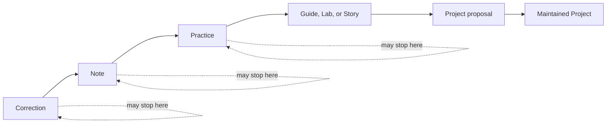

# Contribution Model

## Outcome

Practice makes it easier to share a useful improvement than to produce a polished artifact from scratch. The system starts with a concrete Practitioner problem, accepts small verified contributions, and provides a path to sustained Project stewardship.

## Contribution ladder

The diagram shows possible growth, not a required sequence. A contribution can enter at the path that fits its evidence and stop when it is useful. A Project is open-source software or infrastructure built by the community; a demonstration without intended users belongs in a Lab until it has a credible Project case.

| Path | Contribution promise | Minimum review question | Typical next step |
|---|---|---|---|
| Correction | Make an existing artifact more correct or usable. | Can a reviewer verify the change quickly? | Merge or open a follow-up Note. |
| Note | Preserve a bounded observation or question. | Does it distinguish evidence from interpretation? | Test it, refine it, or leave it as a Note. |
| Practice | Share a reusable method. | Can another Practitioner follow and evaluate it? | Add variations, evidence, or include it in a Guide. |
| Guide, Lab, or Story | Provide a path, experiment, or implementation account. | Does it meet its artifact definition without overstating results? | Update, link, or use it to inform a Project proposal. |
| Project proposal | Establish a shared software or infrastructure need. | Is there a specific user problem, smallest useful release, and proposed maintainer? | Accept, redirect to a Lab, or close with rationale. |
| Maintained Project | Sustain a Project after its initial release. | Is there accountable stewardship and a defined operating process? | Release, maintain, transfer, pause, or retire through human decisions. |

## Two connected surfaces

| Surface | Use it for | Do not use it for |
|---|---|---|
| Buzz | Questions, working discussion, coordination, finding collaborators, and returning a merged result to the community. | The sole copy of a durable artifact, formal acceptance, or a substitute for review history. |
| Git | Issues, branches, pull requests, reviews, accepted artifacts, evidence links, attribution, and releases. | Live conversation that needs back-and-forth context. |

When a Buzz discussion produces a proposal, create or link the Git issue. When it produces an accepted change, link the merged PR or canonical artifact back to Buzz. Summarize material Buzz decisions in Git so a future reviewer does not need access to a thread to understand why work was accepted.

## Operating loop

1. **Name the problem.** The contributor identifies the affected Practitioner, desired outcome, and smallest useful change in an issue—or directly in a narrowly scoped correction PR.
2. **Find context.** The contributor uses Buzz if discussion will improve the work, then links the issue or PR. No separate canonical draft is maintained in Buzz.
3. **Build a reviewable change.** Work happens on a focused branch. The contribution includes evidence suited to its claim and omits private, confidential, or unlicensed material.
4. **Review against the artifact.** Reviewers evaluate usefulness, fit, evidence, safety, reproducibility where applicable, attribution, and scope. They request revisions or redirect the work to a smaller path when appropriate.
5. **Make a human decision.** A maintainer accepts, requests changes, or rejects with a reason. Governance, licensing, access, moderation, and exceptions remain human-owned.
6. **Publish the durable result.** The merge records the accepted work in Git. A release is a separate maintainer decision. Buzz can announce or discuss the result but never substitutes for its Git record.

## Evidence rules

Evidence is proportional, not ceremonial. A correction needs a verifiable explanation; a reusable method needs inputs, steps, outputs, evaluation, and failure modes; a current technical claim needs a primary source and date checked. Personal experience is welcome when labeled as such. Examples and hypotheses must be labeled, and Stories may not manufacture outcomes when evidence is incomplete.

For code or Project work, contributors state what they checked and the result. If a check was unavailable, they state that plainly so the reviewer can decide whether to accept, request it, or limit the claim.

## Attribution and recognition

Git preserves the durable credit: commits, PR descriptions, co-authorship when appropriate, artifact acknowledgments, sources, and license notices. Contributors consent before being named beyond normal repository authorship. Buzz acknowledgments may celebrate a contribution but do not replace the Git record.

Recognition follows demonstrated usefulness: a correction that prevents repeat confusion, a method another Practitioner can reproduce, a careful evidence review, or reliable maintenance. Maintainers may recognize this through release notes, acknowledgments, a Buzz thank-you, or an invitation to co-maintain. Counts of posts, reactions, or activity do not establish status or authority.

## Project stewardship boundary

Before a Project becomes maintained, a human maintainer must accept responsibility and the Project must state its intended users, smallest useful release, repository, license, contribution path, review and release process, and approach to safety or security concerns. The named maintainer decides routine merge and release work within those rules; human-owned governance controls exceptions, transfers, pauses, retirement, licensing, access, and moderation decisions.

This keeps a Project from becoming an unsupported demo and keeps community activity from being mistaken for a maintenance commitment.
