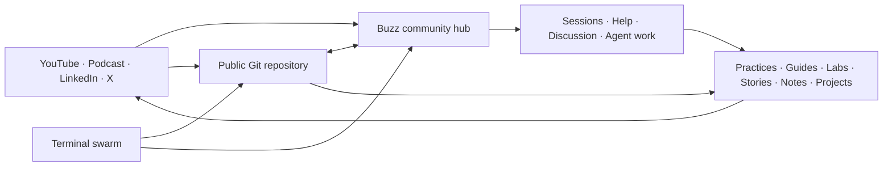

# Practice System Architecture

## Principle

Buzz is the **operating hub**, not the only storage surface.

Putting every durable artifact exclusively into a relay would weaken public discovery, contribution review, version history, forks, offline access, and portability. Practice therefore separates interaction from canonical publication.

## Surfaces

### Buzz — operating hub

- human and agent collaboration;
- onboarding and help;
- live Practice Sessions;
- working discussions;
- project coordination;
- canvases that orient each channel;
- agent-supported curation and maintenance.

### Git — canonical commons

- versioned Practices, Guides, Labs, Stories, Notes, and Projects;
- contribution review;
- licenses and attribution;
- issue and pull-request history;
- reusable code and templates;
- machine-readable task and content schemas.

### Social — distribution

- demonstrations and implementation stories;
- discovery and invitation;
- extracts from community artifacts;
- feedback loops that produce new Practices.

### Terminal swarm — production system

- isolated worktrees;
- bounded task prompts;
- deterministic validation;
- independent review;
- controlled integration;
- optional Buzz status reporting.

## Source-of-truth rules

1. Git wins for durable public artifacts.
2. Buzz wins for current conversation, coordination, and community context.
3. A useful Buzz thread should be distilled into a Note, Practice, Guide update, Lab, Story, issue, or decision.
4. Social content may summarize artifacts but never becomes the only copy.
5. Secrets and confidential source material belong in neither public Git nor Block-hosted Buzz.

## Repository layout

The surfaces above are where Practice operates. The Git repository sorts onto
four shelves, each answering one question a newcomer arrives with: what
Practice publishes, how Practice thinks, how Practice is run, and how the
repository is built. The single full map, directory by directory, is the
[Repository map](../README.md#repository-map) in the root README; this file
does not repeat it.
